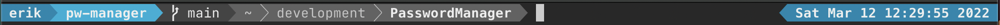
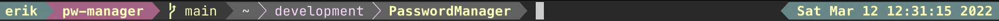

# powerline-cpp

A minimalist implementation of a powerline style prompt in modern C++.

## Samples

powerline-esque:


gruvbox-esque:



## How to use

Currently supports zsh and bash.

Uses ANSI escape sequences.

Build with CMake. Then `sudo make install`.

### zsh

Add the following to your .zshrc and replace [path/to/powerline-cpp/executable] with the corresponding path.
If a prompt on the right-hand side is not desired, simply leave out the
RPS1 line.
```zsh
function powerline_precmd() {
    PS1=$([path/to/powerline-cpp/executable] "$?")
    RPS1=$([path/to/powerline-cpp/executable] "$?" --right)
}

function install_powerline_precmd() {
  for s in "${precmd_functions[@]}"; do
    if [ "$s" = "powerline_precmd" ]; then
      return
    fi
  done
  precmd_functions+=(powerline_precmd)
}

if [ -f [path/to/powerline-cpp/executable] ]; then
    install_powerline_precmd
fi
```

### bash

Add the following to your .bashrc and replace [path/to/powerline-cpp/executable] with the corresponding path
```bash
function _update_prompt() {
    PS1="$([path/to/powerline-cpp/executable] "$?")"
}

if [ -f "[path/to/powerline-cpp/executable]" ]; then
    PROMPT_COMMAND="_update_prompt; $PROMPT_COMMAND"
fi
```

## Customization

By default the prompt uses only ANSI color codes `000` through `015`. If the
terminal emulator remaps these color codes via e.g. a colorscheme, this will be
taken into account.

For each segment, the foreground and background color may be specified in a .toml
file. This file should be placed in $HOME/.config/powerline-cpp/colors.toml. As
a reference, checkout the .toml files in the colors directory.

If a segment is not specified, it's default foreground and background color
will be used. If no config file is found, all segments will have their default colors.
